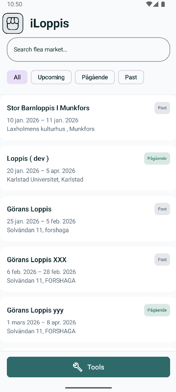
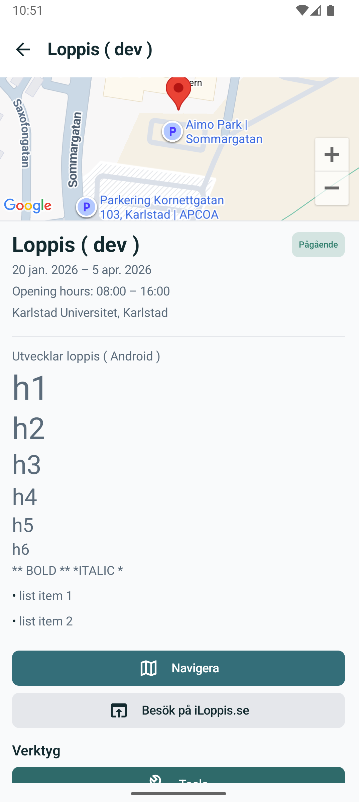
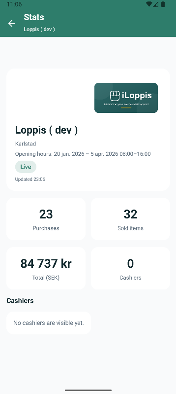

# iLoppis Mobile App

Svensk loppis-app för köpare och säljare.






## 🚀 Snabbstart

### Förutsättningar

**Android:**
- Android Studio eller Android SDK
- Java 17 eller 21 (installera med `brew install openjdk@21`)
- En Android-enhet eller emulator

**iOS:**
- Xcode (från Mac App Store)
- En iOS-simulator eller fysisk enhet

### Kör appen

```bash
# Android på fysisk enhet (anslut via USB, aktivera utvecklarläge)
make android-device

# Android i emulator
make android-emulator

# iOS i simulator
make ios
```

### Alla kommandon

```bash
make help
```

## 📁 Projektstruktur

```
iloppis-app/
├── Makefile           # Övergripande build-kommandon
├── android/           # Android-app (Kotlin)
│   ├── app/           # Applikationskod
│   ├── Makefile       # Android-specifika kommandon
│   └── *.gradle.kts   # Gradle-konfiguration
├── ios/               # iOS-app (Swift)
│   ├── iLoppis/       # Applikationskod
│   ├── Makefile       # iOS-specifika kommandon
│   └── iLoppis.xcodeproj/
└── spec/
    └── swagger/       # API-specifikation
        └── iloppis.swagger.json
```

## 🔧 Utveckling

### Android

Öppna `android/` i Android Studio eller använd kommandoraden:

```bash
# Bygg debug-APK
make android-build

# Kör lint och tester
make android-check

# Se loggar
make android-logs

# Rensa build-filer
make android-clean
```

### iOS

Öppna `ios/iLoppis.xcodeproj` i Xcode eller använd kommandoraden:

```bash
# Bygg för simulator
make ios-build

# Se loggar
make ios-logs

# Rensa build-filer
make ios-clean
```

## 📱 Deploy till fysisk enhet

### Android

1. Aktivera **Utvecklarläge** på telefonen:
   - Gå till Inställningar → Om telefonen
   - Tryck på "Build-nummer" 7 gånger
2. Aktivera **USB-debugging** i Utvecklaralternativ
3. Anslut telefonen via USB
4. Kör:
   ```bash
   make android-devices  # Verifiera att enheten syns
   make android-device   # Bygg och installera
   ```

### iOS

1. Anslut iPhone via USB
2. Öppna projektet i Xcode
3. Välj din enhet som destination
4. Klicka Run (⌘R)

## 🌐 API

Backend-API:et är dokumenterat i `spec/swagger/iloppis.swagger.json`.

**API-endpoint:**
- Staging: `https://iloppis-staging.fly.dev/`

Öppna swagger-filen i [Swagger Editor](https://editor.swagger.io/) för interaktiv dokumentation.

## 🧪 Kvalitetskontroll

```bash
# Kör alla Android-kontroller (lint, säkerhet, tester)
make android-check
```

Detta inkluderar:
- Lint-analys för kodkvalitet
- Säkerhetskontroller (inga hårdkodade hemligheter, korrekt manifest)
- Enhetstester

## 📞 Support

Kontakta projektägaren vid frågor.
